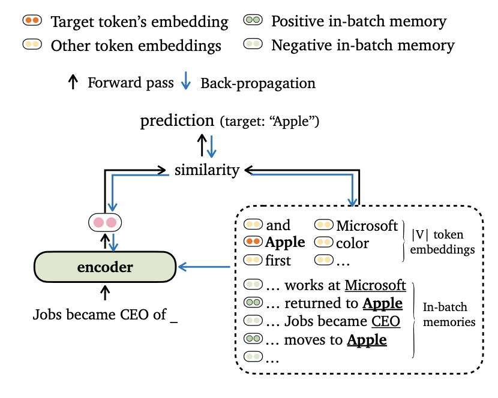
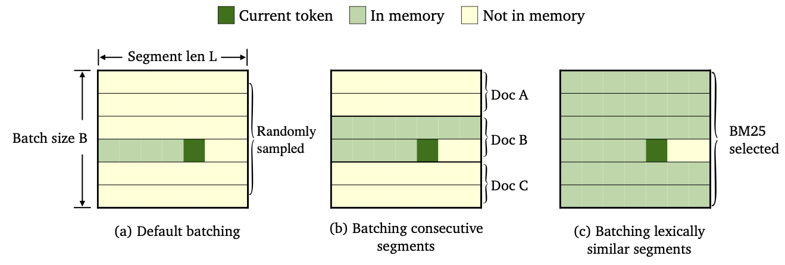

# TRIME: Training Language Models with Memory Augmentation

This is the repository for our EMNLP2022 paper [Training Language Models with Memory Augmentation](https://arxiv.org/abs/2205.12674), by [Zexuan Zhong](https://www.cs.princeton.edu/~zzhong/), [Tao Lei](https://taolei87.github.io), and [Danqi Chen](https://www.cs.princeton.edu/~danqic/).

## Updates
* [2022/11/13] We have released the code and pre-trained models for the machine translation experiments [here](https://github.com/princeton-nlp/TRIME/tree/main/machine_translation). 
* [2022/10/25] Our paper has been accepted to EMNLP 2022! Please check out the [updated version](https://arxiv.org/pdf/2205.12674.pdf). We have added domain adaptation and stronger results on machine translation and character-level language modeling.
* [2022/07/31] We have released our [training code](#train-trimelm) and [pre-trained models](#run-pre-trained-models).
* [2022/05/24] We have released the preprint of our [TRIME paper](https://arxiv.org/pdf/2205.12674v1.pdf) on training LMs with memory augmentation.

## Quick links
* [Overview](#overview)
* [Setup](#setup)
  * [Requirements and dependencies](#requirements-and-dependencies)
  * [Datasets](#datasets)
* [Run Pre-Trained Models](#run-pre-trained-models)
  * [TrimeLM (local memory)](#trimelm-local-memory)
  * [TrimeLM_long (local + long-term memory)](#trimelm_long-local--long-term-memory)
  * [TrimeLM_ext (local + long-term + external memory)](#trimelm_ext-local--long-term--external-memory)
  * [Performance of pre-trained models](#performance-of-pre-trained-models)
* [Train TrimeLM](#train-trimelm)
  * [Trime loss functions](#trime-loss-functions)
  * [Training scripts](#training-scripts)
  * [BM25 batching](#bm25-batching)
* [Machine Translation](#machine-translation)
* [Bugs or Questions?](#bugs-or-questions)
* [Citation](#citation)
* [Acknowledgement](#acknowledgement)

## Overview


We propose a new training objective TRIME for language modeling, which aligns model outputs with both token embeddings and *in-batch memories*. We also devise novel ways for data batching and constructing training memories, so that our models can leverage *long-range contexts* and *external datastore* effectively.

Please find more details of this work in our [paper](https://arxiv.org/pdf/2205.12674.pdf).

## Setup

### Requirements and dependencies
The code is based on the following requirements/dependencies (we specify the version we used in our experiments in brackets):
* Python (3.7.11)
* pytorch (1.9.1+cu111)
* faiss-gpu (1.7.1)
* numpy (1.21.2)

You can install this project (based on Fairseq) as follow:
```bash
pip install --editable .
```

### Datasets
We conduct experiments on the **Wikitext-103** and **enwik8** datasets. Please use `get_data.sh` to download and preprocess the datasets.
```bash
bash get_data.sh {wikitext-103 | enwik8}
```
The processed datasets will be stored in `data-bin/wikitext-103` and `data-bin/enwik8`.

## Run Pre-Trained Models

We show the examples of running pre-trained models on Wikitext-103 with model size = 247M and segment length = 3072. For other experiments (e.g., with different datasets or models), we refer to [run_pretrained_models.md](run_pretrained_models.md) for the scripts on all experimental settings.

### TrimeLM (local memory)
TrimeLM uses only the local memory (constructed using tokens in the input). It can be viewed as a lightweight replacement for vanilla langauge models.
```bash
# download the pre-trained TrimeLM
mkdir pretrained_models; cd pretrained_models
wget https://nlp.cs.princeton.edu/projects/trime/pretrained_models/wiki103-247M-trime.zip;
unzip wiki103-247M-trime.zip; rm -f wiki103-247M-trime.zip
cd ..

# run evaluation
python eval_lm-trime.py data-bin/wikitext-103 \
    --path pretrained_models/wiki103-247M-trime/checkpoint_best.pt \
    --sample-break-mode complete --max-tokens 3072 --context-window 2560 \
    --softmax-batch 1024 --gen-subset valid --fp16 \
    --max-sentences 1 --knn-keytype last_ffn_input \
    --use-local --softmax-temp 1.17

# the following output is expected:
# Loss (base 2): 4.0962, Perplexity: 17.10
```
Arguments:
* `--use-local` specifies using local memory.
* `--softmax-temp` specifies the temperature term used when computing the loss.

### TrimeLM_long (local + long-term memory)
TrimeLM_long uses local memory and long-term memory during inference. The model is able to leverage long contexts, although it is trained with shorter ones.
```bash
# download the pre-trained TRIME_long
mkdir pretrained_models; cd pretrained_models
wget https://nlp.cs.princeton.edu/projects/trime/pretrained_models/wiki103-247M-trime_long.zip;
unzip wiki103-247M-trime_long.zip; rm -f wiki103-247M-trime_long.zip
cd ..

# run evaluation
python eval_lm-trime.py data-bin/wikitext-103 \
    --path pretrained_models/wiki103-247M-trime_long/checkpoint_best.pt \
    --sample-break-mode complete --max-tokens 3072 --context-window 2560 \
    --softmax-batch 1024 --gen-subset valid --fp16 \
    --max-sentences 1 --knn-keytype last_ffn_input \
    --use-local --use-long --mem-size 12288 --softmax-temp 1.22

# the following output is expected:
# Loss (base 2): 4.0879, Perplexity: 17.01
```
Arguments:
* `--use-long` specifies using long-term memory.
* `--mem-size` specifies the size of local + long-term memory.

### TrimeLM_ext (local + long-term + external memory)
TrimeLM_ext uses local memory, long-term memory, and external memory. During inference, we run the model on the training set to build the external memory and use Faiss library to build index for retrieving top-K nearest neighbors the external memory. We also calibrate a separated distribution over the memory and interpolate the output distribution and the memory distribution, similarly to kNN-LM (see details in the paper).

We first download the pre-trained TrimeLM_ext:
```bash
mkdir pretrained_models; cd pretrained_models
wget https://nlp.cs.princeton.edu/projects/trime/pretrained_models/wiki103-247M-trime_ext.zip;
unzip wiki103-247M-trime_ext.zip; rm -f wiki103-247M-trime_ext.zip
cd ..
```

Then, we generate the external memory (keys and values) using the training set and then build the Faiss index:
```bash
MODEL_PATH=pretrained_models/wiki103-247M-trime_ext

# generate the external memory (keys and values) using the training set
python eval_lm.py data-bin/wikitext-103 \
    --path ${MODEL_PATH}/checkpoint_best.pt \
    --sample-break-mode none --max-tokens 3072 \
    --softmax-batch 1024 --gen-subset train \
    --context-window 2560 --tokens-per-sample 512 \
    --dstore-mmap ${MODEL_PATH}/dstore --knn-keytype last_ffn_input \
    --dstore-size 103224461 \
    --save-knnlm-dstore --fp16 --dstore-fp16


# build Faiss index
python build_dstore.py \
    --dstore_mmap ${MODEL_PATH}/dstore \
    --dstore_size 103224461 --dimension 1024 \
    --faiss_index ${MODEL_PATH}/knn.index \
    --num_keys_to_add_at_a_time 500000 \
    --starting_point 0  --dstore_fp16  --dist ip
```

Now, we are ready to evaluate the model:
```bash
MODEL_PATH=pretrained_models/wiki103-247M-trime_ext

python eval_lm-trime.py data-bin/wikitext-103 \
    --path ${MODEL_PATH}/checkpoint_best.pt \
    --sample-break-mode complete --max-tokens 3072 --context-window 2560 \
    --softmax-batch 1024 --gen-subset valid --fp16 \
    --max-sentences 1 --knn-keytype last_ffn_input \
    --use-local --use-long --mem-size 12288 --softmax-temp 1.25 \
    --use-external --dstore-filename ${MODEL_PATH}/dstore --indexfile ${MODEL_PATH}/knn.index.ip \
    --probe 32 --dstore-fp16 --faiss-metric-type ip --no-load-keys --k 1024 \
    --use-interp --interp-temp 10.5 --lmbda 0.3 

# the following output is expected:
# Loss (base 2): 3.9580, Perplexity: 15.54
```
Arguments: 
* `--use-external` specifies using external memory.
* `--dstore-filename` and `indexfile` specify the datastore and the Faiss index paths.
* `--use-interp` specifies using a linear interpolation between two distributions to calibrate final probablity.
* `--lmbda` and `--interp-temp` specify the temerpature term and the weight when using the linear interpolation.

### Performance of pre-trained models
We list the performance of the released pre-trained models on Wikitext-103 and enwik8, as well as their download links.
| Dataset                         | Model        | Dev   | Test  | Hyper-parameters                                                            |
|---------------------------------|--------------|-------|-------|-----------------------------------------------------------------------------|
| Wikitext-103 | [TrimeLM](https://nlp.cs.princeton.edu/projects/trime/pretrained_models/wiki103-247M-trime.zip)<br/>(247M, L=3072)      | 17.10 | 17.76 | `--softmax-temp 1.17`                                                       |
| Wikitext-103 | [TrimeLM_long](https://nlp.cs.princeton.edu/projects/trime/pretrained_models/wiki103-247M-trime_long.zip)<br/>(247M, L=3072) | 17.01 | 17.64 | `--softmax-temp 1.22` `--mem-size 12288`                                    |
| Wikitext-103 | [TrimeLM_ext](https://nlp.cs.princeton.edu/projects/trime/pretrained_models/wiki103-247M-trime_ext.zip)<br/>(247M, L=3072) | 15.54 | 15.46 | `--softmax-temp 1.25` `--mem-size 12288` `--interp-temp 10.5` `--lmbda 0.3` |
| Wikitext-103  | [TrimeLM](https://nlp.cs.princeton.edu/projects/trime/pretrained_models/wiki103-150M-trime.zip)<br/>(150M, L=150)     | 24.45 | 25.61 | `--softmax-temp 1.03`                                                       |
| Wikitext-103  | [TrimeLM_long](https://nlp.cs.princeton.edu/projects/trime/pretrained_models/wiki103-150M-trime_long.zip)<br/>(150M, L=150) | 21.76 | 22.62 | `--softmax-temp 1.07` `--mem-size 15000`                                    |
| enwik8       | [TrimeLM](https://nlp.cs.princeton.edu/projects/trime/pretrained_models/enwik8-38M-trime.zip)<br/>(38M, L=512)     | 1.14  | 1.12  | `--softmax-temp 1.05`                                                       |
| enwik8       | [TrimeLM_long](https://nlp.cs.princeton.edu/projects/trime/pretrained_models/enwik8-38M-trime_long.zip)<br/>(38M, L=512) | 1.08  | 1.05  | `--softmax-temp 1.10` `--mem-size 24576`                                    |


## Train TrimeLM

### Trime loss functions
We follow Fairseq's training recipe (e.g., optimizer, learning rate, batch size) to train TrimeLM. Differently, we use our own loss functions (specified by `--criterion`) and data batching methods.



We trained three varieties of TrimeLM by using different data batching and memory construction methods.
- **TrimeLM** is trained with `--criterion trime_loss`
    * During training, we use previous tokens in the same segment to construct the working memory.
- **TrimeLM_long** is trained with either `--criterion trime_long_loss` or `--criterion trime_long_loss_same_device`
    * We batch consecutive segments into one mini-batch; argument `--keep-order` is needed to batch consecutive segments.
    * During training, we use all the tokens int previous segments and previous tokens in the same segment to construct the working memory.
    * When using `trime_long_loss`, we need to specify the memory size through `--train-mem-size` (num. of consecutive segments will be `args.train_mem_size/args.tokens_per_sample`).
    * When using `trime_long_loss_same_device`, we assume all consecutive segments are loaded in the same GPU device (equivalently `args.mem_size == args.max_tokens`). Using `trime_long_loss_same_device` is more efficient than using `trime_long_loss`, as it requires less cross-GPU communications.
- **TrimeLM_ext** is trained with `--criterion trime_ext_loss`
    * We batch segments that have high BM25 scores into one mini-batch. The results of BM25 batching is specified by `--predefined-batches`.
    * During training, we use all previous tokens in the same segment and all tokens in other segments to construct working memory.
    * With a probability `p`, we disable the local memory (i.e., only using tokens from other segments to construct memory). The probablity `p` is specified by `--cross-sent-ratio`


### Training scripts

Here is an example of training a TrimeLM_ext model.
You can find all training scripts we used in our experiments in [train_scripts](train_scripts/).

We train our models on 4 NVIDIA RTX3090 GPUs.

```bash
# download the results of bm25 batching
wget https://nlp.cs.princeton.edu/projects/trime/bm25_batch/wiki103-l3072-batches.json -P data-bin/wikitext-103/

python train.py --task language_modeling data-bin/wikitext-103 \
    --save-dir output/wiki103-247M-trime_ext \
    --arch transformer_lm_wiki103 \
    --max-update 286000 --max-lr 1.0 --t-mult 2 --lr-period-updates 270000 --lr-scheduler cosine --lr-shrink 0.75 \
    --warmup-updates 16000 --warmup-init-lr 1e-07 --min-lr 1e-09 --optimizer nag --lr 0.0001 --clip-norm 0.1 \
    --criterion trime_ext_loss --max-tokens 3072 --update-freq 6 --tokens-per-sample 3072 --seed 1 \
    --sample-break-mode none --skip-invalid-size-inputs-valid-test --ddp-backend=no_c10d --knn-keytype last_ffn_input --fp16 \
    --ce-warmup-epoch 9 --cross-sent-ratio 0.9 \
    --predefined-batches data-bin/wikitext-103/wiki103-l3072-batches.json
```
Important arguments:
* `--arch` specifies the model architecture. In our experiments, we have been using the following architectures.
    * `transformer_lm_wiki103` (a 247M model for wikitext-103)
    * `transformer_lm_wiki103_150M` (a 150M model for wikitext-103)
    * `transformer_lm_enwik8` (a 38M model for enwik8)
* `--criterion` specifies the function to compute loss values. See description above about which functions we support.
* `--tokens-per-sample` specifies the segment length.
* `--max-tokens` specifies the number of tokens to be loaded in each GPU.
* `--update-freq` specifies the gradient-accumulation steps.
* `--ce-warmup-epoch` specifies how many epoches the original CE loss is used at the beginning to warm-up the training.
* `--cross-sent-ratio` specifies the probability `p` to disable the local memory.
* `--predefined-batches` specifies the file path of the predefined batches (we use BM25 to batch segments).

### BM25 batching
When training the TrimeLM_ext model with `--criterion trime_ext_loss`, we use BM25 scores to batch training data. 

We use the [Pyserini](https://github.com/castorini/pyserini) library to build BM25 index. The library can be installed via pip.
```bash
pip install pyserini
```

We first save all the segments from the training set into a `.json` file.
```bash
mkdir -p bm25/wiki103-l3072/segments
CUDA_VISIBLE_DEVICES=0 python train.py --task language_modeling \
    data-bin/wikitext-103 \
    --max-tokens 6144 --tokens-per-sample 3072 \
    --arch transformer_lm_wiki103 \
    --output-segments-to-file bm25/wiki103-l3072/segments/segments.json

# Modify --tokens-per-sample for different segment lengths
```

Then, we build the BM25 index using Pyserini.
```bash
python -m pyserini.index.lucene \
  --collection JsonCollection \
  --input bm25/wiki103-l3072/segments \
  --index bm25/wiki103-l3072/bm25_index \
  --generator DefaultLuceneDocumentGenerator --threads 1 \
  --storePositions --storeDocvectors --storeRaw
```

Next, for each training segment, we search the similar segments using the BM25 index we built above.
```bash
python bm25_search.py \
    --index_path bm25/wiki103-l3072/bm25_index/ \
    --segments_path bm25/wiki103-l3072/segments/segments.json \
    --results_path bm25/wiki103-l3072/bm25_results

# Use --num_shards and --shard_id; you can parallel the computation of NN search (e.g., --num_shards 20).
```

Finally, based on the retrieval results, we create batches by group similar segments.
```bash
python bm25_make_batches.py \
    --results_path bm25/wiki103-l3072/bm25_results \
    --batch_file data-bin/wikitext-103/wiki103-l3072-batches.json
```

The output file `wiki103-l3072-batches.json` contains a list of indices of training segments and adjacent segments are likely to be similar. 

The batch file `wiki103-l3072-batches.json` can be used during the training of TrimeLM_ext, with the argument `--predefined-batches`.
During training, we simply get training batches by taking sub-lists sequencitally from the file.

## Machine Translation
For machine translation code and experiments, please check out the [subdirectory](https://github.com/princeton-nlp/TRIME/tree/main/machine_translation).

# Bugs or Questions?
If you have any questions related to the code or the paper, or you encounter any problems when using the code, feel free to email Zexuan Zhong `(zzhong@cs.princeton.edu)` or open an issue. Please try to specify the problem with details so we can help you better and quicker!

# Citation
If you use our code in your research, please cite our work:
```bibtex
@inproceedings{zhong2022training,
   title={Training Language Models with Memory Augmentation},
   author={Zhong, Zexuan and Lei, Tao and Chen, Danqi},
   journal={Empirical Methods in Natural Language Processing (EMNLP)},
   year={2022}
}
```

# Acknowledgement
Our repo is based on the [fairseq](https://github.com/facebookresearch/fairseq), [knnlm](https://github.com/urvashik/knnlm), and [adaptive-knn-mt](https://github.com/zhengxxn/adaptive-knn-mt) projects. We thank the authors for open-sourcing the great code!
